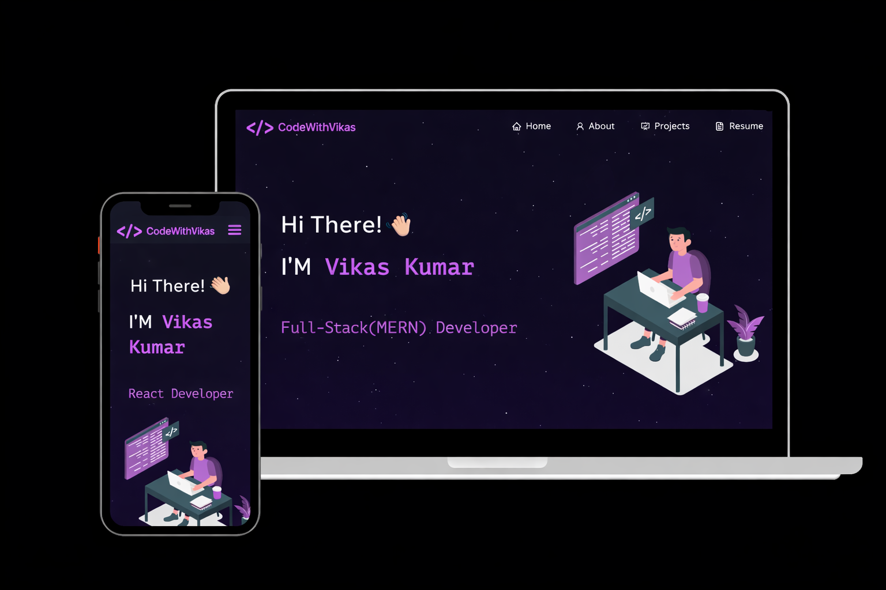

<h2 align="center">
  Portfolio Website<br/>
  <a href="https://portfolio-omega-ten-87.vercel.app/" target="_blank">VK.tech</a>
</h2>

<div align="center">
  
</div>

<br/>

<div align="center">

[](https://forthebadge.com) &nbsp;
[](https://forthebadge.com) &nbsp;
[](https://forthebadge.com) &nbsp;

</div>

<h3 align="center">
  🔹
  <a href="https://github.com/VikasKumar281/Portfolio/issues">Report Bug</a>
  &nbsp; &nbsp;
  🔹
  <a href="https://github.com/VikasKumar281/Portfolio/issues">Request Feature</a>
</h3>

---

You are welcome to fork this repository and customize it for your own use.  
Please make sure to give proper credit by linking back to  
[VikasKumar281](https://github.com/VikasKumar281/Portfolio).  
Thank you!

---

## Built With

This is my personal portfolio website, which showcases my GitHub projects, resume, and technical skills.  
<br/>
The project was built using the following technologies:
- React.js
- Node.js
- Express.js
- CSS3
- VS Code
- Vercel

---

## Features

- 📖 Multi-page layout  
- 🎨 Styled with React-Bootstrap and CSS, with easy-to-customize colors  
- 📱 Fully responsive design  

---

## Getting Started

Clone this repository to your local machine.  
Make sure you have `Node.js` and `Git` installed globally.

---

## 🛠 Installation and Setup Instructions

1. Install dependencies:
   ```bash
   npm install
