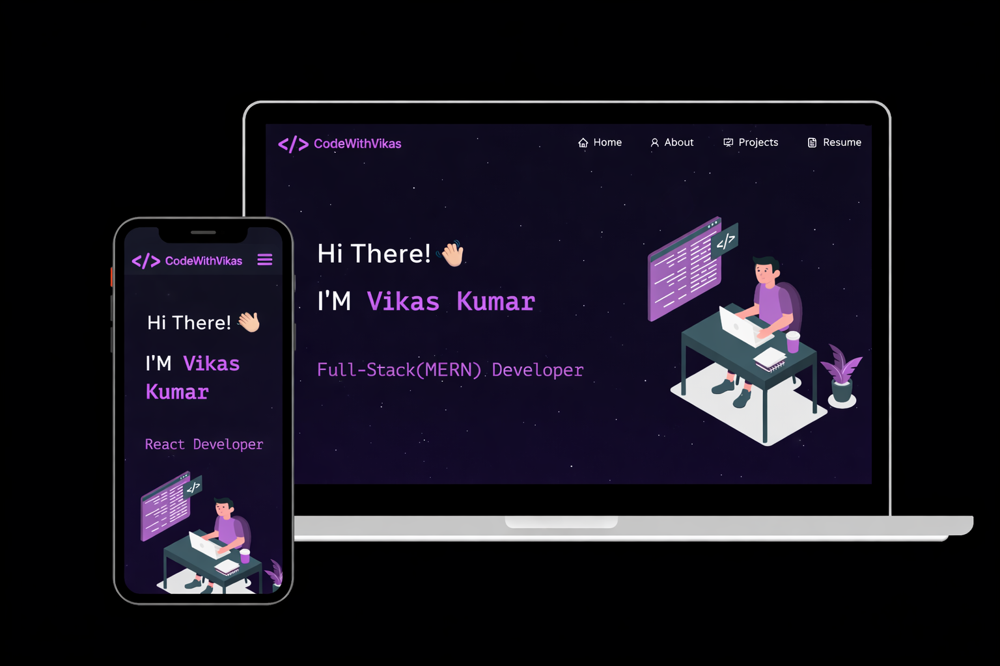

<h1 align="center">
  Vikas Kumar — Portfolio
</h1>

<p align="center">
  <strong>Full Stack Developer | React.js | Node.js | Python</strong>
</p>

<p align="center">
  A modern, responsive personal portfolio website showcasing my technical skills,
  projects, experience, resume, and software development journey.
</p>

<p align="center">
  <a href="https://portfolio-omega-ten-87.vercel.app/" target="_blank">
    🌐 Live Portfolio
  </a>
  &nbsp; • &nbsp;
  <a href="https://github.com/VikasKumar281" target="_blank">
    GitHub
  </a>
  &nbsp; • &nbsp;
  <a href="https://github.com/VikasKumar281/Portfolio/issues" target="_blank">
    Issues
  </a>
</p>

---

## 📸 Portfolio Preview

<div align="center">

  

</div>

<br />

<div align="center">

[](https://forthebadge.com)
&nbsp;
[](https://forthebadge.com)
&nbsp;
[](https://forthebadge.com)

</div>

---

## 👋 About

This repository contains my personal developer portfolio website.

The website is designed to present my work and technical profile in a simple,
interactive, and responsive interface. It brings together my projects,
technical skills, development tools, resume, and professional information
in one place.

The portfolio is built with a component-based React architecture and uses
React Router for page navigation, React-Bootstrap for layout and responsive
components, custom CSS for styling, and Vercel for deployment.

---

## ✨ Highlights

- 📌 Personal developer portfolio
- ⚛️ Built with React.js
- 🧩 Component-based architecture
- 🗂️ Dedicated projects section
- 📄 Online resume viewer and CV download
- 🛠️ Technical skillset and developer tools section
- 📱 Responsive layout for desktop, tablet, and mobile
- 🎨 Custom dark-themed UI
- ✨ Interactive particle background
- 🔗 GitHub and live project links
- 🚀 Deployed with Vercel
- 🧭 Multi-page navigation using React Router

---

## 🧭 Website Structure

The portfolio is organized into dedicated routes:

| Route | Purpose |
|------|---------|
| `/` | Home page and introduction |
| `/about` | About me, technical skills, and tools |
| `/project` | Project showcase |
| `/resume` | Resume preview and CV download |

Navigation and route handling are implemented using React Router.

---

## 🏗️ Main Sections

### 🏠 Home

The homepage introduces me as a Full Stack Developer and provides a quick
overview of my background, interests, technical direction, and development
focus.

### 👨‍💻 About

The About section contains:

- Personal introduction
- Educational background
- Professional experience
- Technical skills
- Areas of interest
- Development tools and technologies

### 🚀 Projects

The Projects section highlights selected work across:

- Full Stack Web Development
- MERN applications
- AI / Machine Learning
- NLP and RAG systems
- Data Engineering
- Cloud and DevOps
- Computer Vision / Deep Learning
- Materials Informatics

Each project card can include:

- Project cover image
- Project name
- Project description
- GitHub repository
- Live demo when available

### 📄 Resume

The Resume section provides an online resume preview along with downloadable
CV actions.

The application loads the resume as a local PDF asset and renders the first
page using `react-pdf`.

---

## 🧰 Technology Stack

### Frontend

- React.js
- JavaScript
- React-Bootstrap
- Bootstrap
- CSS3
- React Router
- React Icons

### Backend / APIs

- Node.js
- Express.js
- REST APIs
- EmailJS integration

### Data & AI

- Python
- MongoDB
- PostgreSQL
- Redis
- Machine Learning
- RAG
- Speech AI

### Cloud / DevOps

- AWS
- Docker
- Kubernetes
- Git
- GitHub
- Vercel
- Render

### Development Tools

- Visual Studio Code
- Postman
- Jupyter Notebook

---

## 📂 Project Structure

```text
Portfolio/
│
├── public/
│   ├── favicon.png
│   ├── index.html
│   ├── manifest.json
│   ├── preview.png
│   └── robots.txt
│
├── Images/
│   ├── readme-image.png
│   └── readme-img.png
│
├── src/
│   │
│   ├── Assets/
│   │   ├── Projects/
│   │   ├── TechIcons/
│   │   └── Resume/
│   │
│   ├── components/
│   │   ├── About/
│   │   ├── Home/
│   │   ├── Projects/
│   │   ├── Resume/
│   │   ├── Footer.js
│   │   ├── Navbar.js
│   │   ├── Particle.js
│   │   ├── Pre.js
│   │   └── ScrollToTop.js
│   │
│   ├── App.js
│   ├── App.css
│   ├── index.css
│   └── style.css
│
├── .gitignore
├── package.json
├── package-lock.json
└── README.md
```

---

## ⚙️ Getting Started

### Prerequisites

Make sure the following are installed:

- Node.js
- npm
- Git

You can verify the installation with:

```bash
node --version
npm --version
git --version
```

---

## 🚀 Installation

### 1. Clone the repository

```bash
git clone https://github.com/VikasKumar281/Portfolio.git
```

### 2. Move into the project directory

```bash
cd Portfolio
```

### 3. Install dependencies

```bash
npm install
```

### 4. Start the development server

```bash
npm start
```

The application will start on:

```text
http://localhost:3000
```

---

## 🧪 Production Build

To create an optimized production build:

```bash
npm run build
```

The generated production files will be available inside:

```text
build/
```

---

## 🖥️ Run the Production Build Locally

Install the static server package:

```bash
npm install -g serve
```

Then run:

```bash
serve -s build
```

---

## 🌐 Deployment

This portfolio is deployed using Vercel.

### Deploy with Vercel

1. Push the project to GitHub.
2. Import the repository into Vercel.
3. Select the project framework as React if it is not detected automatically.
4. Use the following build command:

```text
npm run build
```

5. Deploy the project.

### Live Website

🌐 https://portfolio-omega-ten-87.vercel.app/

---

## 🔄 Git Workflow

A simple workflow for updating the portfolio:

```bash
git pull origin main
```

Make the required changes and test locally:

```bash
npm start
```

Run the production build:

```bash
npm run build
```

Then commit and push:

```bash
git add .
git commit -m "Update portfolio"
git push origin main
```

---

## 🎨 Customization

This repository can be customized for another developer portfolio.

### Personal Information

Update:

- Name
- Introduction
- Education
- Experience
- Contact information
- Social links

### Projects

Projects can be updated inside:

```text
src/components/Projects/Projects.js
```

Each project can contain:

- Image
- Title
- Description
- GitHub URL
- Live demo URL

### Skills

Technical skills and tools can be updated through the relevant components in:

```text
src/components/About/
```

### Resume

The resume PDF is stored as a project asset and is referenced from:

```text
src/components/Resume/ResumeNew.js
```

---

## 📱 Responsive Design

The portfolio is designed to adapt to different screen sizes.

The UI uses responsive React-Bootstrap grid components along with custom CSS
to support:

- Desktop
- Laptop
- Tablet
- Mobile

---

## ✨ UI & Experience

The website includes several visual and interaction elements:

- Dark developer-themed interface
- Purple accent styling
- Particle background
- Responsive navigation
- Animated/interactive sections
- Project cards
- Resume viewer
- Developer skill icons
- GitHub and live-demo buttons

---

## 📌 Featured Projects

Some of the projects showcased in the portfolio include:

### QuickStay

Full-stack hotel booking platform using React.js, Node.js, Express.js,
MongoDB, and Tailwind CSS.

### SupportAgentAI

Customer-support automation system using Python, intent classification,
historical retrieval, risk detection, and escalation workflows.

### CognifyAI

RAG and Speech AI assistant for document understanding, semantic search,
transcription, and contextual responses.

### NeuroSeg

Deep learning project for brain MRI tumor segmentation using an Attention
U-Net based architecture.

### Airflow Data Pipeline

Data engineering workflow using Apache Airflow, Amazon S3, Amazon Redshift,
Python, and SQL.

### Yelp API ETL

Python ETL pipeline that extracts business data from the Yelp Fusion API,
transforms it, and loads it into PostgreSQL.

### ANN-Based Deformation Mechanism Maps

Materials-informatics project using Artificial Neural Networks to model
hot-deformation behavior of 2219-Al and 2219-Al–0.1 wt% Ag alloys and generate
deformation mechanism maps.

---

## 🔐 Security & Best Practices

When customizing or deploying the project:

- Never commit API keys or passwords.
- Keep private credentials in environment variables or platform secrets.
- Avoid committing unnecessary generated files.
- Validate external URLs before adding them to project cards.
- Run a production build before deployment.
- Keep dependency versions consistent with `package-lock.json`.

---

## 🐛 Troubleshooting

### `npm install` fails

Try:

```bash
npm cache verify
npm install
```

### `npm start` does not work

Check:

```bash
node --version
npm --version
```

Then reinstall dependencies.

On Windows PowerShell:

```powershell
Remove-Item -Recurse -Force node_modules
npm install
```

### Production build fails

Run:

```bash
npm run build
```

locally first and inspect the exact error reported by the compiler.

---

## 🤝 Contributing

This is a personal portfolio project, but suggestions, bug reports, and
improvements are welcome.

To report an issue:

https://github.com/VikasKumar281/Portfolio/issues

You can also fork the repository and adapt it for your own portfolio.

---

## 📄 License

This project is intended primarily as a personal portfolio website.

You are welcome to study the structure and customize it for your own use.
Please retain appropriate credit to the original repository and author when
using substantial portions of the project.

---

## 👨‍💻 Author

**Vikas Kumar**

B.Tech — Mechatronics Engineering  
Indian Institute of Information Technology, Bhagalpur

GitHub:  
https://github.com/VikasKumar281

Portfolio:  
https://portfolio-omega-ten-87.vercel.app/

---

## ⭐ Support

If you find this portfolio useful or use it as inspiration for your own
developer website, consider giving the repository a ⭐ on GitHub.

---

<div align="center">

### Built with React.js and a lot of curiosity 🚀

**Vikas Kumar**

</div>
